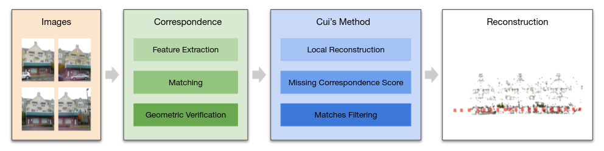
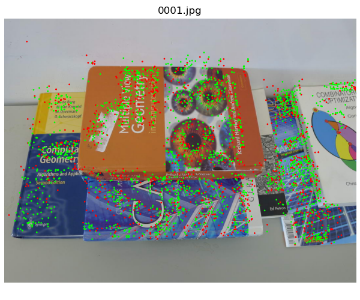
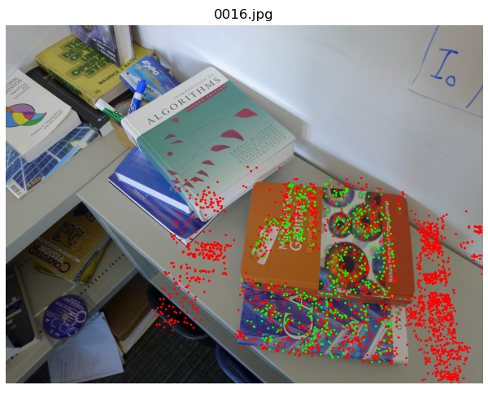
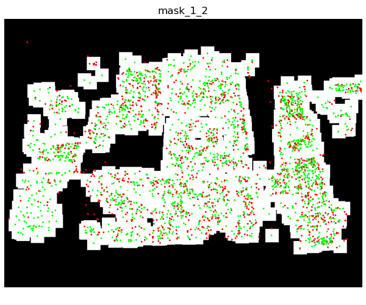
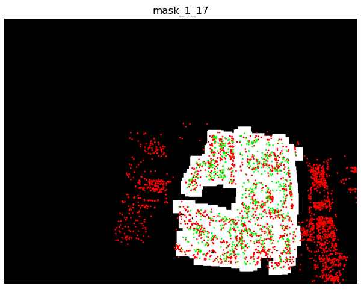
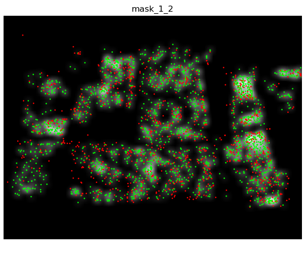
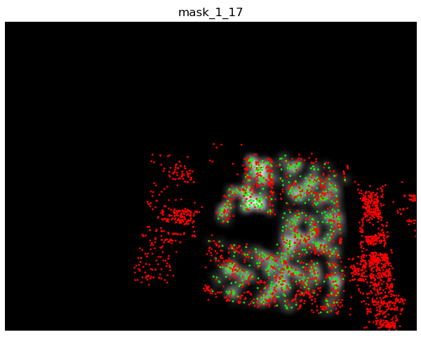

# SfM disambiguation with COLMAP

## About

Structure-from-Motion generally fails when the scene exhibits symmetries and duplicated structures. In this repository, we implement several state-of-the-art algorithms that aim at addressing this problem, we integrate them into [COLMAP](https://colmap.github.io/), and we extensively analyze their performance. We hope that this effort can ease further research on this problem.

We focus on filtering out incorrect matches between images prior to SfM. The filtering process is done by reimplementing the ideas from [Distinguishing the indistinguishable: Exploring structural ambiguities via geodesic context](https://yanqingan.github.io/docs/cvpr17_distinguishing.pdf) by Yan et al. (CVPR 2017) and [Global Structure-from-Motion by Similarity Averaging](https://openaccess.thecvf.com/content_iccv_2015/papers/Cui_Global_Structure-From-Motion_by_ICCV_2015_paper.pdf) by Cui et al. (ICCV 2015). We also include the experiment results from [Improving Structure from Motion with Reliable Resectioning](https://rajbirkataria.com/assets/ImprovingStructurefromMotionwithReliableResectioning.pdf) by Kataria et al. (3DV 2020) based on [their implementation](https://github.com/rajkataria/ReliableResectioning). We refer to these three papers as Yan's method, Cui's method, and Kataria's method respectively. This repository uses [COLMAP](https://github.com/colmap/colmap) and [hloc](https://github.com/cvg/Hierarchical-Localization) for feature extraction and matching, and [COLMAP](https://github.com/colmap/colmap) for geometric verification and sparse reconstruction.

**TLDR: No method consistently works well over all datasets with a single set of hyperparameters. Tuning the parameters for large scenes is difficult and time-consuming for all three methods.**

Drop an email to [Lixin Xue](mailto:lixxue@ethz.ch) if you are interested in this problem and want to chat!

<p align="center">
    
    <br /><em>Results on the Alexander Nevsky Cathedral Dataset</em>
</p>

## Conclusions

Based on our experiments, we have the following observations:

- Duplicate structures in images often lead to an excessive number of image matches and non-converging bundle adjustment. These will lengthen the reconstruction time significantly. Removing the wrong matches or initializing the poses correctly can significantly speed up the reconstruction process.
- With a correct initial pair of images and a perfect next view selection, `colmap` might still output a reconstruction with many wrongly registered images. Even Kataria's method to initialize poses based on reliable matches was still insufficient to disambiguate some datasets. Therefore, a less noisy pose graph is necessary for a correct reconstruction.
- Both Yan's method and Cui's method need some scene-specific parameter tuning. Kataria's method has better generalization ability, though still fails on several datasets even though we tune the parameters for it. **No method consistently works well over all datasets with a single set of parameters. Tuning the parameters for certain scenes (especially large scale ones) is difficult and time-consuming for all three methods.**

## Installation

```
# python 3.7 is required for the 'capture_output' keyword in `subprocess.run`
# which is only used in the notebooks
conda create -n sfm python=3.7 -y

# install [colmap](https://colmap.github.io/install.html).
# install [hloc](https://github.com/cvg/Hierarchical-Localization#installation)

# library for the plot of match graphs
sudo apt-get install graphviz graphviz-dev
pip install pygraphviz
conda install -c anaconda networkx -y
# for interactive control of parameters in the notebooks
conda install -c conda-forge jupyterlab ipywidgets -y
# can skip this if using colmap for visualization of 3D models
conda install -c open3d-admin -c conda-forge open3d -y

# install this library in development mode for further modifications
python install -e .
```

We also provide the datasets we use via [google drive](https://drive.google.com/file/d/1y6qB16R8kiyMfUjCHI5rFnZU_fRacQcc/view?usp=sharing). Please download it and then unzip it under the folder `datasets` to have the following layout:

```
|---datasets
    |---heinly2014
        |---...
    |---yan2017
        |---...
```

## Pipelines

We provide two [jupyter notebooks](./notebooks/) as examples for the complete pipelines of Yan's method and Cui's method. These two methods share a similar pipeline by first computing a score for each image pair and then removing wrong matches based on the score. After that, the filtered matches are passed to the incremental reconstruction stage. In Yan's method, they use raw matches to compute tracks and use the percentage of shared unique tracks between two images as the score for an image pair. While in Cui's method, they do a local reconstruction for every image and use the [missing correspondence](http://www.cvg.ethz.ch/research/chzach/pdf/cvpr2008-preprint.pdf) idea to create a score for every image pair.

<p align="center">
    
    
    <br /><em>Similar Pipelines for Yan's method and Cui's method</em>
</p>

### 1. Correspondence

First, we can extract features from images using `colmap` or `hloc`. We provide the following features with their corresponding keywords in the parentheses:

1. `colmap` SIFT with default parameters (`sift_default`)
2. `colmap` sparser SIFT features with the first octave set to be 0 (`sift_sparse`)
3. [SuperPoint](https://github.com/cvg/Hierarchical-Localization/blob/master/hloc/extractors/superpoint.py) (`superpoint`)
4. [D2-Net](https://github.com/cvg/Hierarchical-Localization/blob/master/hloc/extractors/d2net.py) (`d2net`)
5. [R2D2](https://github.com/cvg/Hierarchical-Localization/blob/master/hloc/extractors/r2d2.py) (`r2d2`)
6. [DISK](https://github.com/lxxue/Hierarchical-Localization/tree/r2d2/hloc) (`disk`, still a pull request in `hloc`)

For SIFT features extracted by `colmap`, we use the exhaustive nearest neighbor matching provided by `colmap`.

For learned features extracted by `hloc`, we use the exhaustive nearest neighbor matching provided by `hloc`. Specifically for the [SuperPoint](https://github.com/cvg/Hierarchical-Localization/blob/master/hloc/extractors/superpoint.py) feature, we can also use the trained [SuperGlue](https://github.com/cvg/Hierarchical-Localization/blob/master/hloc/matchers/superglue.py) model for matching.

Then, we use `colmap matches_importer` to perform geometric verification (compute two-view geometries from the matches) with different RANSAC parameters (check `colmap_matching_options` in [options/matching_options.py](./disambiguation/options/matching_options.py)).

### 2. Disambiguation

Next, we can use Yan's method or Cui's method to compute the scores for all the matches. After that, we can choose to use a threshold filter, a top k filter, or a percentile filter to remove suspicious matches. We create a new database with the filtered matches and recompute two-view geometries.

We choose to pre-filter matches rather than post-process the reconstructed model as done in the paper [Correcting for Duplicate Scene Structure in Sparse 3D Reconstruction](https://www.cs.unc.edu/~jheinly/publications/eccv2014-heinly.pdf) by Heinly et al based on the observations stated in the section [Conclusions](#conclusions).

### 3. Reconstruction

Lastly, we use `colmap mapper` to reconstruct the whole scene incrementally. Depending on the dataset, you can choose to fix the intrinsics from EXIF or not (check [options/mapper_options.py](./disambiguation/options/mapper_options.py)).

## Yan's Method

[Distinguishing the Indistinguishable: Exploring Structural Ambiguities via Geodesic Context](https://yanqingan.github.io/docs/cvpr17_distinguishing.pdf). CVPR 2017.

By Qingan Yan, Long Yang, Ling Zhang, Chunxia Xiao.

### Basic Steps

The key idea is that geodesic neighbors capturing the same instance of duplicate structures usually share more matches than images of different instances of duplicate structures. With this in mind, they:

1. generate tracks from raw matches;
2. select the iconic set of images to summarize the whole scene by maximizing an objective function that favors completeness (#observed tracks) and penalizes repetitiveness (#tracks occurring in more than one image);
3. split the tracks covered by the images in the iconic set into two parts: those appearing only in one image of the iconic set are defined as unique tracks, while the other tracks appearing more than once in the images of the iconic set are defined as confusing tracks.
4. define a score for `match_ij: len(unique_ij) / max(len(unique_i), len(unique_j))`, i.e. the percentage of common unique tracks shared by the two images

### Differences between the Original Implementation and the Paper

Our implementation follows the [original implementation](https://github.com/yanqingan/SfM_Disambiguation) shared by the author. However, there are some differences between the author's code and the paper:

1. In the actual implementation, the non-iconic images are also used as the backbone of the path network. Therefore, the match graph is not "a bipartite graph with nodes respectively are iconic images and non-iconic images". The construction of the iconic set is only for the construction of the unique tracks and confusing tracks.
2. In the original paper, the match will be kept as long as two images share enough unique tracks. However, the percentage of unique tracks is also used to filter out matches in the implementation.
3. The $\alpha$ in formula (3) is set to 0 in the code while it is required to be larger than 0 in the paper. As a consequence, the stopping criterion for the construction of the iconic set is different: in the paper the iconic set will be fixed once adding any one of the images will not increase the objective function (3). Instead, the author provides a `coverage threshold` to stop the expansion of the iconic set once the objective is larger than this threshold. This change is necessary since the objective function will be monotonically increasing with $\alpha = 0$.

### Parameters Tuning

The original implementation has two parameters (`coverage_thres` and `score_thres`) to tune. Here is the comment from the author:

> The coverage controls how many iconic images will be selected. As for small-scale indoor scenes, a large value between 0.7 and 0.9 is recommended; otherwise, for large-scale unstructured datasets, the value around 0.6 would be enough.
>
> Parameter score_thres defines whether an image pair is acceptable. As for small-scale scenes, similarly, a large threshold (around 0.3) is recommended; otherwise, for large-scale outdoor scenes, score_thres between 0.04 and 0.1 would be a good choice.
>
> For instance, for the Alexander Nevsky Cathedral dataset, we use coverage = 0.6 and score_thres = 0.1 to achieve well-registered 3D point clouds.

In our implementation, we expose another 4 parameters to tune:

- `track_degree`: the minimal length of a track to be taken into account. Increasing it will discard more short tracks.
- `alpha`: the $\alpha$ in formula (3) of the paper. Increasing it will require the images in the iconic set to be more distinctive.
- `minimal_views`: the minimal number of shared tracks for a match to be valid. Increasing it means fewer matches will be valid.
- `ds`: the data structure used to store the list of matches. You can leave it unchanged (default `largearray`) as the default value is a good tradeoff between speed and memory. For large datasets with thousands of images like `berliner_dom` (1618 images), it is necessary to use the `smallarray` data structure or limit the maximum number of keypoints in an image. In this case, it would be extremely slow (more than 8 hours for `berliner_dom`) due to a large number of images and the inefficient data structure.

## Cui's Method

[Global Structure-from-Motion by Similarity Averaging](https://openaccess.thecvf.com/content_iccv_2015/papers/Cui_Global_Structure-From-Motion_by_ICCV_2015_paper.pdf). ICCV 2015.

By Zhaopeng Cui and Ping Tan.

### Basic Steps

In this paper, the authors utilize the missing correspondences cue to remove wrong matches.

1. For each image and its direct neighbors, compute a two-view reconstruction by triangulation with the baseline set to 1.
2. Merge these two-view reconstructions into one local reconstruction by solving a linear system based on the scale consistency in the stellar graph.
3. Project the merged 3D points to each neighbor and calculate its missing correspondence score.

For more details, please check Section 4 of the [paper](https://openaccess.thecvf.com/content_iccv_2015/papers/Cui_Global_Structure-From-Motion_by_ICCV_2015_paper.pdf).

### Missing Correspondence Score

In the paper, there are two types of projected 3D points in the field of view of the image: the observed keypoints (matched features) in this image and the ones observed in other images but not in this image (missing features).

The author takes the bounding boxes of matched features and calculates the percentage of missing points in the bounding boxes as the missing correspondence score. For example, these two images below display the projected 3D points from image 0 into image 1 and image 16, respectively.

<p float="left">
    
    
</p>

However, this formulation is not stable since the bounding box is extremely sensitive to outliers: one outlier might enlarge the box to the entire image frame. In addition, the bounding box doesn't take into account the perspective transformation between images, where a square in one image would not be a square in another image.

Therefore, we propose a more fine-grained score by using a small square box around every keypoints instead of a big bounding box around all the keypoints. Below is the visualization of the new masks of the images shown above. With this modification, the score is more reliable and distinctive for the disambiguation.

<p float="left">
    
    
</p>

We further try to take the distance between matched features and missing features into account by using a Gaussian mask around the keypoints:

<p float="left">
    
    
</p>

This scoring method requires a smaller threshold since the score is typical around ~0.1. We did not experiment much with this scoring method, so we are not sure if it is better than the previous version.

### Parameters

- `score_version`: we provide three score formulations as stated above. Version 1 is the method using a bounding box around keypoints presented in the paper. Version 2 is using a uniform square around every keypoint. Version 3 is using a Gaussian square around every keypoint.
- `min_num_valid_depths`: minimal number of correct reconstructed depths for a 3D point to be valid (The depth consistency check in the paper).
- `max_num_neighbors`: maximal number of neighbors used for the reconstruction. It is used to avoid the inefficiency caused by dense clusters of images.
- `square_radius`: the size of the square around each keypoint for the score versions 2 and 3.
- `parallel`: whether to use multiple threads for the computation of the scores. The statistics of the runtime is not accurate in parallel mode.
- `plot`: whether to plot the masks and the image with projected 3D points. For large datasets, it is advisable not to plot as plotting will have a significant overhead.

## Visualizations

### Fine-tuned Parameters

Now we show some results of the implemented methods. The gif on the upper left displays the images in each dataset. The gif on the upper right is the reconstructions from the `colmap` with default parameters. The bottom left and the bottom right gifs display the reconstructions after disambiguation with Yan's method and Cui's method, respectively.

One thing worth noticing is that the parameters used for different datasets are different: we kind of cheat by tuning the parameters based on the pose graphs.

#### Books

<!--
<p float="left">
    
    
    
</p>
-->

<p float="left">
    
    
</p>
<p float="left">
    
    
</p>

#### Cereal

<!--
<p float="left">
    
    
    
</p>
-->
<p float="left">
    
    
</p>
<p float="left">
    
    
</p>

#### Cup

<!--
<p float="left">
    
    
    
</p>
-->
<p float="left">
    
    
</p>
<p float="left">
    
    
</p>

#### Desk

<!--
<p float="left">
    
    
    
</p>
-->

<p float="left">
    
    
</p>
<p float="left">
    
    
</p>

(the image on the most left is misregistered with `colmap`, while it is corrected with either one of the two methods)

#### Oats

<!--
<p float="left">
    
    
    
</p>
-->

<p float="left">
    
    
</p>
<p float="left">
    
    
</p>

(both methods failed as the ground truth should be something like a sequence instead of two sequences in parallel)

<!--

-->

#### Street

<p float="left">
    
    
</p>
<p float="left">
    
    
</p>

#### Temple of Heaven

<p float="left">
    
    
</p>
<p float="left">
    
    
</p>

#### Alexander Nevsky Cathedral

<p float="left">
    
    
</p>
<p float="left">
    
    
</p>

### Same Parameters

To investigate to what extent a set of parameters would be applicable for all datasets, we apply the parameters tuned for the Alexander Nevsky Cathedral dataset on other Internet collections of images.

#### Arc de Triomphe

<p float="left">
    
    
</p>
<p float="left">
    
</p>

### Berliner Dom

<p float="left">
    
    
</p>
<p float="left">
    
</p>

#### Big Ben

<p float="left">
    
    
</p>
<p float="left">
    
</p>

#### Brandenburg Gate

<p float="left">
    
    
</p>
<p float="left">
    
</p>

(With a proper choice of the threshold, we can disambiguate the model into several parts.)

#### Church of Savior on the Spilled Blood

<p float="left">
    
    
</p>
<p float="left">
    
</p>

(With a proper choice of the threshold, we can disambiguate the model into several parts.)

#### Radcliffe Camera

<p float="left">
    
    
</p>
<p float="left">
    
</p>

(The correct reconstruction is split into two parts due to the lack of transitional camera views)

### Kataria's Method

Here we would like to also display the results from the paper [Improving Structure from Motion with Reliable Resectioning](https://rajbirkataria.com/assets/ImprovingStructurefromMotionwithReliableResectioning.pdf) by Rajbir Kataria, Joseph DeGol, Derek Hoiem. For more details, please refer to the [repository](https://github.com/rajkataria/ReliableResectioning) provided by the authors. We refer to this method as Kataria's method hereafter.

Based on the observation that longer tracks are more likely to contain wrong matches, the authors propose to use a track-length-adjusted number of matches as the criterion for the next view selection. More importantly, the initial pose of the image to be registered will rely only on 3D points from reliable images instead of all triangulated points. This is important as our experiments show that a correct registration order does not necessarily lead to a correct reconstruction. This method only contains two parameters to be set: the track length discount factor &lambda; and the reliable image threshold &tau;. More significantly, the same set of parameters could work on many different scenes, greatly reducing the burden of tuning parameters for the above mentioned two methods.

For a fair comparison, we investigate the changed files in the original repository and integrate them with the current version of colmap with small modifications. We run the `exhaustive_matcher` instead of `vocab_tree_matcher` as done in previous methods. Since the parameters provided by the author are tuned for OpenSfm, we also tried to tune the parameters (&lambda; changed from 0.5 to 0.3, &tau; changed from 2.0 to 1.3) for colmap on the cup and the oats dataset. The results are shown below:

#### Cup

<p float="left">
    
    
</p>
(The reconstruction on the left is with the parameters provided by the authors, while the one on the right is with the parameters tuned by us)

#### Oats

<p float="left">
    
    
</p>
(The reconstruction on the left is with the parameters provided by the authors, while the one on the right is with the parameters tuned by us. Note that we did not find a set of suitable parameters for Yan's or Cui's method to disambiguate this scene)

#### Results on Large Scale Datasets

However, when we use these two sets of parameters on the large scale Internet datasets provided by Heinly et al, both sets of the parameters give us similar reconstructions and they are somewhat inferior to what we can get from Yan's or Cui's method:

#### Alexander Nevsky Cathedral

<p float="left">
    
    
</p>

(In the left reconstruction, some of the misregistered cameras should be placed in the blue circle to create a correct reconstruction like the one on the right)

#### Big Ben

<p float="left">
    
    
</p>

(Note the suspicious wall in the blue circle in the left reconstruction, which should be an empty street as in the right reconstruction)

#### Radcliffe Camera

<p float="left">
    
</p>

(This set of parameters for Kataria's method cannot distinguish the two sides of Radcliffe Camera, while Yan's method and Cui's method work)

### Reproduction

For the reproduction of the above results for Kataria's method, we put the changed/added files in the [reliable_resectioning](./reliable_resectioning/src) folder. You can merge all the files in this directory with colmap's source code and then compile it. We also provide a [bash script example](./scripts/reliable_resectioning_exhaustive_colmap.sh) for generating sparse reconstruction with the newly compiled colmap.

## Codebase Walkthrough

```
|---datasets
    |---heinly2014
        |---...
    |---yan2017
        |---...
|---disambiguation
    |---geodesic_consistency        # code for Yan's method
    |---mmissing_correspondences    # code for Cui's method
    |---options     # parameters for features/matching/mapper
    |---utils       # some helper functions
    |---calculate_geodesic_consistency_scores.py        # interface for calculating match scores based on Yan's method
    |---calculate_missing_correspondences_scores.py     # interface for calculating match scores based on Cui's method
    |---extract_match_features.py                       # interface for extract and match features
|---reliable_resectioning
    |---src         # modified colmap source files for Kataria's method
|---results
    |---${dataset_name}
        |---${feature_type}_${matching_type}_${geometric_verification_type}
            |---plots_${parameters}             # plots for missing correspondences in Cui's method
            |---sparse                          # reconstruction using colmap without disambiguation
            |---sparse_yan_${parameters}        # reconstruction using Yan's method
            |---sparse_cui_${parameters}        # reconstruction using Cui's method
            |---db_yan_${parameters}.db         # storing matches filtered with Yan's method
            |---db_cui_${parameters}.db         # storing matches filtered with Cui's method
            |---${dataset_name}.db              # storing unfiltered matches
            |---scores_yan_${parameters}.npy    # socres for matches using Yan's method
            |---scores_cui_${parameters}.npy    # scores for matches using Cui's method
            |---...
|---notebooks
    |---$steet_${method_name}.ipynb   # example for running the codebase and tuning the parameters on the street dataset.
|---scripts
    |---disambiguate_yan.py     # example of using Yan's method for scores
    |---disambiguate_cui.py     # example of using Cui's method for scores
    |---filter_matches.py       # example of filtering matches based on scores
    |---match_features.py       # example of extracting and matching features
```

## Datasets

We mainly use the datasets from [Yan's repo](https://github.com/yanqingan/SfM_Disambiguation) and [Heinly's website](https://www.cs.unc.edu/~jheinly/duplicate_structure.html), where they include some datasets from [Roberts et al.](https://snsinha.github.io/pdfs/RobertsCVPR2011.pdf) and [Jiang et al.](http://www.cs.sfu.ca/~pingtan/Papers/cvpr12_sfm.pdf). We packed the cleaned-up version of these datasets (with images renamed and features removed) into a [zip file](https://drive.google.com/file/d/1y6qB16R8kiyMfUjCHI5rFnZU_fRacQcc/view?usp=sharing) for downloads.

To experiment with other datasets, you can place new datasets under `yan2017` or `heinly2014` with the following structure:

```
|---datasets
    |---heinly2014
        |---${your_dataset_name}
            |---images
                |--- *.[jpg/png/...]

```

then you can use your `${your_dataset_name}` as argument `dataset_name` to run the code on new datasets.

## Literature Review

Here are some relevant papers and their summaries:

- Pose Graph: nodes are images, edges are epipolar geometries

  - [[Zach CVPR 2010](http://people.inf.ethz.ch/pomarc/pubs/ZachCVPR10.pdf), [Shen ECCV 2016](https://www.researchgate.net/publication/308278729_Graph-Based_Consistent_Matching_for_Structure-from-Motion)]: loop consistency
  - [[Jiang CVPR 2012](https://www.ece.nus.edu.sg/stfpage/eleclf/cvpr12_sfm.pdf)]: feature consistency
  - [[Heinly ECCV 2014](https://www.cs.unc.edu/~jheinly/publications/eccv2014-heinly.pdf)]: conflicting unique points
  - [[Cui ICCV 2015](https://zhpcui.github.io/projects/ICCV2015_SfM/)]: missing correspondences on a local stellar graph
  - [[Wang BMVC 2018](http://www.bmva.org/bmvc/2018/contents/papers/0718.pdf)]: local reconstruction score for camera distances

- Visibility Graph: nodes are images and tracks(3D points), edges are visibility

  - [[Wilson ICCV 2013](https://www.cs.cornell.edu/projects/disambig/files/disambig_iccv2013.pdf)]: missing correspondences for removing bad tracks
  - [[Yan CVPR 2017](https://yanqingan.github.io/docs/cvpr17_distinguishing.pdf)]: augmented with geodesic consistency to split bad tracks

- Some other papers

  - [[Roberts CVPR 2011](https://www.microsoft.com/en-us/research/wp-content/uploads/2016/02/Roberts-CVPR11.pdf)]: missing correspondences + timestamp cues
  - [[Cohen CVPR 2012](https://ieeexplore.ieee.org/document/6247841)]: detect symmetries and enforce them as constraints in optimization
  - [[Ceylan TOG 2013](https://dl.acm.org/doi/10.1145/2517348)]: user-specified pattern to detect repeated patterns for facade
  - [[Heinly 3DV 2014](https://www.cs.unc.edu/~jheinly/publications/3dv2014-heinly.pdf)]: similar idea but faster compared to [Heinly ECCV 2014]
  - [[Kataria 3DV 2020](https://github.com/rajkataria/ReliableResectioning/blob/raj.reliable-resectioning/Improving%20Structure%20from%20Motion%20with%20Reliable%20Resectioning.pdf)]: use track length to adjust match score for next view selection; only use reliable 3D points for image registration

- Common techniques: Minimum Spanning Tree

  - [[Zach CVPR 2010](http://people.inf.ethz.ch/pomarc/pubs/ZachCVPR10.pdf)]: sample loops for testing consistency (top-down)
  - [[Jiang CVPR 2012](https://www.ece.nus.edu.sg/stfpage/eleclf/cvpr12_sfm.pdf)]: modify spanning tree to minimize feature-metric loss
  - [[Heinly ECCV 2014](https://www.cs.unc.edu/~jheinly/publications/eccv2014-heinly.pdf)]: generate proposals for cuts into subgraphs
  - [[Shen ECCV 2016](https://www.researchgate.net/publication/308278729_Graph-Based_Consistent_Matching_for_Structure-from-Motion)]: start from MST to form the full pose graph (bottom-up)
  - [[Wang BMVC 2018](http://www.bmva.org/bmvc/2018/contents/papers/0718.pdf)]: cut MST into groups for clustering

## Acknowledgement

This work was done by [Lixin Xue](https://lxxue.github.io/), a Master's student at ETH Zurich, under the supervision of [Paul‑Edouard Sarlin](https://psarlin.com/) and [Mihai Dusmanu](https://dsmn.ml/). We would like to thank [Qingan Yan](https://yanqingan.github.io/) for sharing the [original implementation and datasets](https://github.com/yanqingan/SfM_Disambiguation), [Jared Heinly](https://www.cs.unc.edu/~jheinly/) for sharing the [datasets](https://www.cs.unc.edu/~jheinly/duplicate_structure.html), and [Rajbir Kataria](https://rajbirkataria.com/about/) for helping out with the setup of his work.
